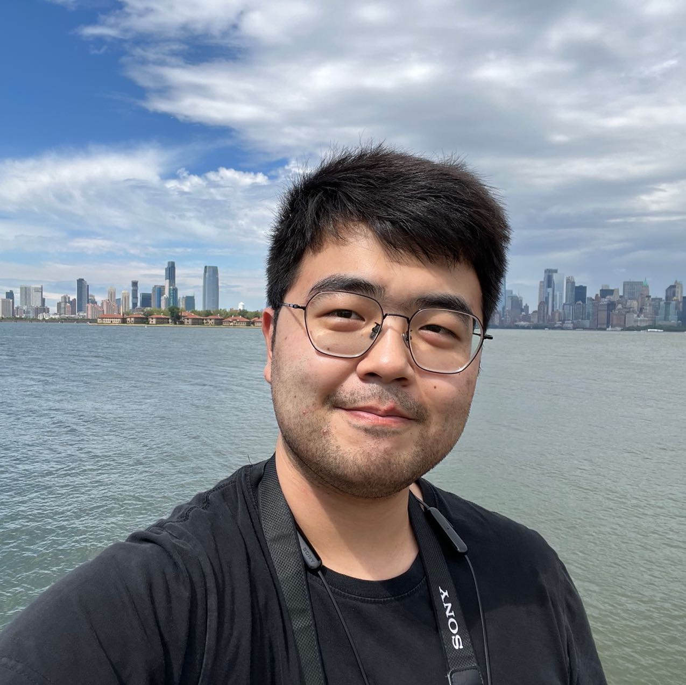

  

Last updates: 2025-02-08

**I am looking for a postdoctoral postion!**

I am currently a Ph.D. candidate working with Randall Martin in the [Atmospheric Composition Analysis Group](https://sites.wustl.edu/acag/)
at Washington University in St. Louis. My current research
focuses on using data-driven methods combined with the air quality model,
ground-based observations, and satellite retrievals to investigate air pollution.
I have been working on estimating of fine resolution [global $\rm{PM_{2.5}}$
concentration](/data/GlobalV6PM25_Data/), developing [regional $\rm{PM_{2.5}}$ and composition concentration with uncertainties](/data/NorthAmericaV6PM25_Data/).

Prior to my PhD, I received a B.S. in Physics and a B.A.
in Economics from [Peking University](https://english.pku.edu.cn/) in 2020.
My undergraduate research was advised by [Dr. Lin Zhang](http://scholar.pku.edu.cn/acaq) focuses
on analyses of fine particulate matter sources across China with an adjoint version of the GEOS-Chem model and investigation
of diurnal ammonium trends in Beijing with a nested GEOS-Chem model.

In my spare time, I like hiking, swimming, ukulele, and cooking.
